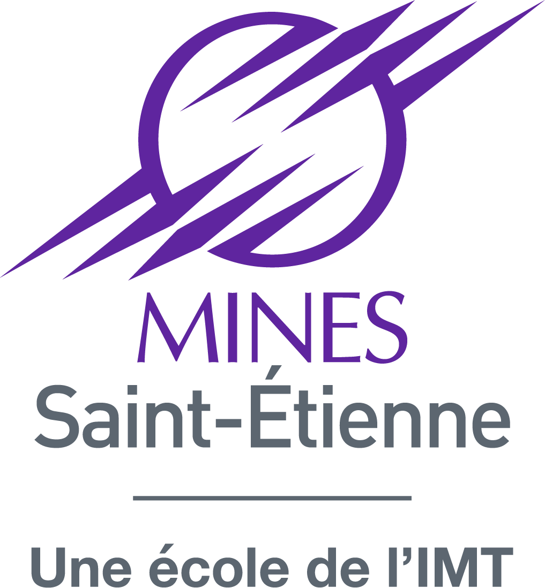

# Théophile Gousselot

🇫🇷 [Français](#soutenance-de-thèse)

🇬🇧 [English](#phd-defense)

## Soutenance de thèse

**« Mécanismes de sécurité d’un processeur RISC-V face aux attaques par injection de fautes »**

### Informations:
- mercredi 18 juin 2025 à 9h30
- Gardanne, « Amphi 1 » du Campus Aix-Marseille Provence de l'École des Mines de Saint-Étienne (880 route de Mimet, 13541, Gardanne)

### Visioconférence / Videoconference
[https://zoom.us/j/540664269](https://zoom.us/j/540664269)

### Défense de Thèse / PhD Defense

| Jury                 |                                                           |              |
| ----                 | ----                                                      | ----         |
| Vianney LAPÔTRE      | Maître de conférences, Université Bretagne Sud            | Rapporteur   |
| Paolo MAISTRI        | Chargé de recherche, CNRS, Laboratoire TIMA               | Rapporteur   |
| Pascal BENOIT        | Professeur des universités, Université de Montpellier     | Examinateur  |
| David HÉLY           | Professeur des universités, Universités Grenoble INP, UGA | Examinateur  |
| Karine HEYDMANN      | Experte sécurité, Thales DIS - Sorbonne Université        | Examinatrice |
| Jean-Baptiste RIGAUD | Professeur, Mines de Saint-Étienne                        | Directeur    |
| Jean-Max DUTERTRE    | Professeur, Mines de Saint-Étienne                        | Co-directeur |
| Olivier POTIN        | Maître Assistant, Mines de Saint-Étienne                  | Encadrant    |

### Résumé :
Les systèmes embarqués évoluent dans des environnements non contrôlés. Si leur sûreté est indispensable, leur sécurité face à des attaques intentionnelles l’est également. Par des approches physiques, un attaquant malveillant peut contourner des étapes de sécurité ou extraire des informations. La sécurisation d’un programme et de son exécution repose sur la définition d’un modèle de menace. Historiquement, les attaques logicielles et les attaques physiques non- ou semi-invasives ont été massivement considérées. Dans ce manuscrit, notre volonté a été d’explorer la conception de contremesures face à des modèles de menace plus larges.

Le premier considère des injections de fautes ciblant les signaux de contrôle de la microarchitecture et non plus seulement les instructions. L’approche proposée permet d’unifier l’intégrité des signaux avec celle des instructions et du flot de contrôle. Les instructions chargées en mémoire sont chiffrées dans un certain ordre, on dit qu’elles sont « chaînées ». L’algorithme de chiffrement absorbe les valeurs de signaux provenant de tous les étages du processeur. Chaque instruction est déchiffrée avant d’être exécutée. En cas d’injection de fautes sur les instructions, sur les signaux ou même sur l’ordre d’exécution des instructions, le déchiffrement causera la génération d’instructions aléatoires : le déchiffrement « sort de la chaîne ». Les instructions obtenues ne seront plus celles du programme et, à la première instruction illégale décodée, le processeur détectera l’attaque.

Le second modèle de menace aborde les attaques physiques invasives dans le cadre d’une extraction linéaire de code. Un attaquant identifie et dépose des microsondes d’écoute sur le bus d’instructions. En déposant d’autres microsondes dans la microarchitecture, il force le défilement linéaire du code sur le bus d’instructions et donc son extraction. Nous évaluons d’une part la complexité naturelle de l’attaque sur des processeurs RISC-V. D’autre part, nous introduisons trois contremesures légères augmentant drastiquement le nombre de microsondes à déposer en parallèle sur le système embarqué.

L’ensemble des contremesures introduites au cours de ce travail de thèse ont été implémentées dans un processeur RISC-V (CV32E40P) sur FPGA. Elles ont été validées tout au long du flot de conception afin de proposer des démonstrateurs fonctionnels. Les diverses injections de fautes envisagées ont été mises en œuvre en simulation et émulées sur FPGA. L’ensemble de ces travaux sont partagés en libre accès. 

### Financement
Ce travail a bénéficié d’une aide de l’État gérée par l’Agence Nationale de la Recherche au titre de France 2030 au sein du projet ARSENE portant la référence ANR-22-PECY-0004.

---

## PhD Defense

**"Security Mechanisms in a RISC-V Processor Against Fault Injection Attacks"**

### Detail
- Wednesday, 18 June 2025, at 9:30 am
- Gardanne, in the amphitheater of the École des Mines de Saint-Étienne, Centre Microélectronique de Provence, Campus Aix-Marseille-Provence, located at 880 Avenue de Mimet, 13120 Gardanne
- The defence will be conducted in French.

### Videoconference

[https://zoom.us/j/540664269](https://zoom.us/j/540664269)

### Jury

| Jury                 |                                                           |              |
| ----                 | ----                                                      | ----         |
| Vianney LAPÔTRE      | Maître de conférences, Université Bretagne Sud            | Reviewer     |
| Paolo MAISTRI        | Chargé de recherche, CNRS, Laboratoire TIMA               | Reviewer     |
| Pascal BENOIT        | Professeur des universités, Université de Montpellier     | Examiner     |
| David HÉLY           | Professeur des universités, Universités Grenoble INP, UGA | Examiner     |
| Karine HEYDMANN      | Experte sécurité, Thales DIS - Sorbonne Université        | Examiner     |
| Jean-Baptiste RIGAUD | Professeur, Mines de Saint-Étienne                        | Thesis supervisor    |
| Jean-Max DUTERTRE    | Professeur, Mines de Saint-Étienne                        | Thesis supervisor    |
| Olivier POTIN        | Maître Assistant, Mines de Saint-Étienne                  | Thesis supervisor    |

### Abstract:
Embedded systems operate in uncontrolled environments. Ensuring their safety is paramount, but it is equally crucial to consider their security against intentional attacks. A malicious attacker can bypass security measures and steal information. Securing a program and its execution relies on the definition of a threat model. Historically, software attacks and nonor semi-invasive physical attacks have been widely considered. In this manuscript, our goal was to explore the design of countermeasures against further threat models.

The first addresses fault injections targeting control signals of the microarchitecture, not just instructions. The proposed approach unifies the integrity of signals with that of instructions and control flow. The instructions flashed into the memory are encrypted in a specific order forming a chain. The encryption algorithm absorbs signal values from all processor stages. Each instruction is decrypted before being executed. If faults are injected into the instructions, the signals, or even the order in which the instructions are executed, the decryption will generate random instructions : the decryption deviates from the chain. The instructions obtained will no longer be those of the program and, at the first illegal instruction decoded, the processor will detect the attack.

The second threat model deals with invasive physical attacks to achieve a linear code extraction. An attacker identifies and places eavesdropping microprobes on the instruction bus. By strategically deploying additional microprobes to tamper with the microarchitecture, he forces the linear flow of code on the instruction bus. First, we assess the complexity of performing an LCE on RISC-V processors. Secondly, we introduce three lightweight countermeasures that drastically increase the number of microprobes to be placed in parallel on the embedded system.

All the countermeasures introduced in this work have been implemented in a RISC-V processor (CV32E40P) on FPGA. They were tested and validated at each stage of the design flow to provide functional FPGA demonstrators. Various fault injections were conducted through simulation and emulated on FPGA. All of this work is freely accessible.

## Funding

The ARSENE project was funded by the “France 2030” government investment plan managed by the French National Research Agency, under the reference “ANR-22-PECY-0004”.

<!---

    
    
    

-->

